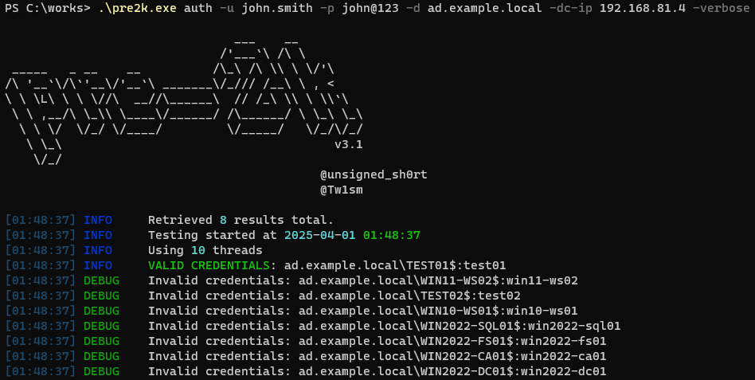
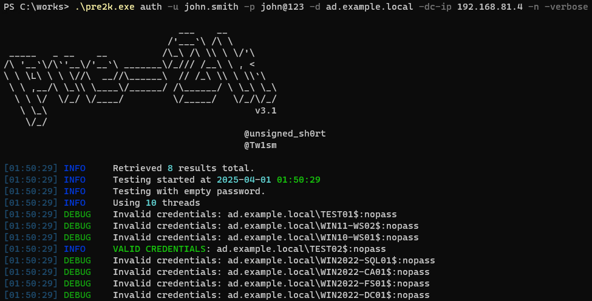

```
                                            ___    __         
                                          /'___`\ /\ \        
             _____   _ __    __          /\_\ /\ \\ \ \/'\    
            /\ '__`\/\`'__\/'__`\ _______\/_/// /__\ \ , <    
            \ \ \L\ \ \ \//\  __//\______\  // /_\ \\ \ \\`\  
             \ \ ,__/\ \_\\ \____\/______/ /\______/ \ \_\ \_\
              \ \ \/  \/_/ \/____/         \/_____/   \/_/\/_/
               \ \_\                                      v3.0    
                \/_/                                          
                                                        @garrfoster
                                                        @Tw1sm       
```

# Pre2k

Pre2k is a tool to query for the existence of pre-windows 2000 computer objects which can be leveraged to gain a foothold in a target domain as discovered by [TrustedSec's](https://www.trustedsec.com/blog/diving-into-pre-created-computer-accounts/) [@Oddvarmoe](https://twitter.com/Oddvarmoe). Pre2k can be ran from an uanuthenticated context to perform a password spray from a provided list of recovered hostnames (such as from an RPC/LDAP null bind) or from an authenticated context to perform a targeted or broad password spray. Users have the flexibility to target every machine or to stop on the first successful authentication as well as the ability to request and store a valid TGT in `.ccache` form in their current working directory.

This repository is for converting pre2k into a standalone executable binary that runs on Windows.

## Installation

```
git clone https://github.com/n-etupirka/pre2k-exe-binary.git
cd .\pre2k-exe-binary\
python.exe -m pip install virtualenv
python.exe -m venv venv
.\venv\Scripts\activate
python.exe -m pip install -r .\requirements.txt
pyinstaller.exe --onefile .\pre2k.py
.\dist\pre2k.exe --help
```

## Usage


### Unauthenticated Usage


### Authenticated Usage


## Examples

### Reset Accounts / Pre-Windows 2000 Computers

```
.\pre2k.exe auth -u john.smith -p john@123 -d ad.example.local -dc-ip 192.168.81.4 -verbose
```



### Blank Passwords

```
.\pre2k.exe auth -u john.smith -p john@123 -d ad.example.local -dc-ip 192.168.81.4 -n -verbose
```


